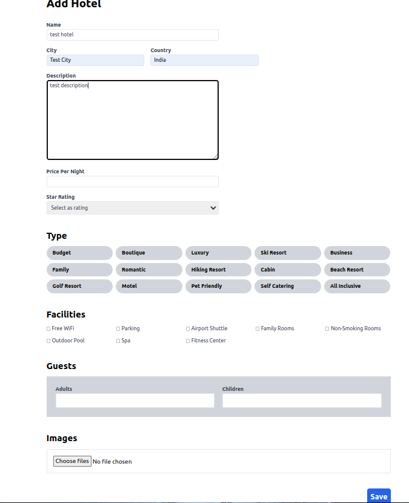

# [RoomReady.com](https://roomready-com.onrender.com)

This full-stack web application is built using the **MERN** (MongoDB, Express, React, Node.js) stack and mimics the core functionalities of the popular hotel booking platform, Booking.com. Whether you're looking to book a cozy hotel room for a weekend getaway or a luxurious suite for a business trip, this application provides an intuitive and seamless booking experience.


## Tech Stack

**Client:** React JS, Redux Toolkit, React Query, React-Stripe

**Server:** Node JS, Express JS

**Database:** Mongo DB

**Password-hashing:** B-Crypt

**Authentication/Authorization:** JWT

**Payments:** Stripe

## Features

### Authentication

- Tech Stack: express-validator, react-hook-form, bcrypt

#### Registration


- Registration Route: POST <https://roomready-com.onrender.com/api/users/register>

   | Headers      |                  |
   | ------------ | ---------------- |
   | key          | value            |
   | Content-Type | application/json |

  Body

```JSON
{
"FirstName": "Sam",
"LastName": "Smith",
"email": "sam@gmail.com",
"password": "sam123456",
"confirmPassword": "sam123456"
}
```

- cookies auth_token gets created.

#### Login


- Login Route: POST <https://roomready-com.onrender.com/api/auth/login>

   | Headers      |                  |
   | ------------ | ---------------- |
   | key          | value            |
   | Content-Type | application/json |

  Body

```JSON
{
"email": "sam@gmail.com",
"password": "sam123456"
}
```

- cookies auth_token gets refreshed.

#### Logout

- Logout Route: POST <https://roomready-com.onrender.com/api/auth/logout>

- cookies auth_token gets expired.

### Search Page


- Search Route: GET <https://roomready-com.onrender.com/api/hotels/search?destination=pune&checkIn=2024-06-05T12%3A57%3A48.068Z&checkOut=2024-06-07T12%3A57%3A48.000Z&adultCount=1&childCount=1&page=1&maxPrice=&sortOption=>

- Response:

```JSON
       {
            "_id": "664a4ddf532a5f20ae33edfe",
            "userId": "6624146b5817e9ef91e3773d",
            "name": "Royal Orchids Golden Suites",
            "city": "Pune",
            "country": "India",
            "description": "Royal Orchid Golden Suites Pune offers spacious all suite accommodation with kitchen facilities, free private parking and facilities including a fully equipped fitness centre.\r\n\r\nSuites at the Royal Orchid feature 24-hour room service. Each suite has a living area, fully equipped kitchenette, balcony and LCD TV with satellite channels.\r\n\r\nPune Airport is located just 5-minutes away. A stone’s throw away from Royal Orchid are multiplexes and shopping malls. Airport transfer is available at an additional cost.\r\n\r\nKasba Cafe serves a wide breakfast buffet spread and is open for lunch and dinner. The menu includes a variety of snacks and Indian, Chinese and Continental cuisines.",
            "type": "Luxury",
            "adultCount": 2,
            "childCount": 2,
            "facilities": [
                "Free WiFi",
                "Parking",
                "Airport Shuttle",
                "Non-Smoking Rooms",
                "Outdoor Pool",
                "Fitness Center"
            ],
            "pricePerNight": 3690,
            "starRating": 4,
            "imageUrls": [
                "http://res.cloudinary.com/deadlock08/image/upload/v1716145629/zxu0n*****zcfxpsg.jpg",
                "http://res.cloudinary.com/deadlock08/image/upload/v1716145631/mqjxg*****jsrrzkgc.jpg",
                "http://res.cloudinary.com/deadlock08/image/upload/v1716145628/uum******yqwrvaglq.jpg",
                "http://res.cloudinary.com/deadlock08/image/upload/v1716145628/vef********huktxtw9mn.jpg"
            ],
            "lastUpdated": "2024-05-19T19:07:11.663Z",
            "bookings": [
                {
                    "firstName": "Rohan",
                    "lastName": "Sharma",
                    "email": "rohan@gmail.com",
                    "adultCount": 1,
                    "childCount": 1,
                    "checkIn": "2024-06-03T19:18:15.746Z",
                    "checkOut": "2024-06-05T19:18:15.000Z",
                    "userId": "6624146b5817e9ef91e3773d",
                    "_id": "665e178add5b9ff804e660d1"
                }
            ],
            "__v": 0
        },
        {
            "_id": "664a4e50532a5f20ae33ee01",
            "userId": "6624146b5817e9ef91e3773d",
            "name": "Hyatt Palace",
            "city": "Pune",
            "country": "India",
            "description": "Hyatt Place Pune is an upscale, contemporary business hotel designed for multi-tasking travelers. Centrally located in the IT and corporate location of Pune in Hinjawadi; the hotel offers signature experiences. It is closer to the airport and is conveniently located close to Mumbai-Pune expressway, making it accessible and experiential for business professionals and explorers.\r\n\r\nDining options include 24/7 Gallery Café that offers a selection of Indian and International cuisine while the Bakery Case offers an array of tempting pastries and sweets. Coffee to Cocktails Bar offers specialty coffee and tea selections, and a variety of alcoholic and non-alcoholic beverages. Guests can enjoy a fresh-made meal at the all-day gallery menu or select grab and go snacks from the 24/7 gallery market.",
            "type": "Luxury",
            "adultCount": 2,
            "childCount": 1,
            "facilities": [
                "Free WiFi",
                "Parking",
                "Airport Shuttle",
                "Non-Smoking Rooms",
                "Outdoor Pool",
                "Spa",
                "Fitness Center"
            ],
            "pricePerNight": 6800,
            "starRating": 4,
            "imageUrls": [
                "http://res.cloudinary.com/deadlock08/image/upload/v1716145744/n9x********kbotpgkpf3.jpg",
                "http://res.cloudinary.com/deadlock08/image/upload/v1716145743/xr9o******qsz1ulk.jpg",
                "http://res.cloudinary.com/deadlock08/image/upload/v1716145743/qakn*****itxh.jpg"
            ],
            "lastUpdated": "2024-05-19T19:09:04.872Z",
            "bookings": [
                {
                    "firstName": "Rohan",
                    "lastName": "Sharma",
                    "email": "rohan@gmail.com",
                    "adultCount": 1,
                    "childCount": 1,
                    "checkIn": "2024-06-04T17:32:30.105Z",
                    "checkOut": "2024-06-05T17:32:30.000Z",
                    "userId": "6624146b5817e9ef91e3773d",
                    "totalCost": 6800,
                    "_id": "665f5063caa3b61527647be5"
                }
            ],
            "__v": 0
        }
    ],
    "pagination": {
        "total": 2,
        "page": 1,
        "pages": 1
    }
```

### Add Hotel



- Add Hotel Route: POST <https://roomready-com.onrender.com/api/my-hotels>

   | Headers      |                  |
   | ------------ | ---------------- |
   | key          | value            |
   | Content-Type | application/json |

  Body

```JSON
{
    "userId": "6624146b5817e9ef91e3773d",
    "name": "new hotel ",
    "city": "new city",
    "country": "new country",
    "adultCount": 1,
    "bookings": [],
    "childCount": 2,
    "city": "new city",
    "country": "new country",
    "description": "new description ",
    "facilities": ["Free WiFi", "Non-Smoking Rooms", "Spa"],
    "imageUrls": ["http://res.cloudinary.com/deadlock08/image/upload/v1717613225/ujb46hzry23******otgtdl.jpg",…],
    "lastUpdated": "2024-06-05T18:47:06.141Z",
    "name": "new hotel ",
    "pricePerNight": 1200,
    "starRating": 3,
    "type": "Hiking Resort",
    "userId": "6624146b5*******1e3773d",
    "__v": 0,
    "_id": "6660b2aabbaea6305684d03a"
}
```

### My Hotels


- My Hotels Route: GET <https://roomready-com.onrender.com/api/my-hotels>

- Response:

```JSON
[  {
        "_id": "664a4e50532a5f20ae33ee01",
        "userId": "6624146b*******e3773d",
        "name": "Hyatt Palace",
        "city": "Pune",
        "country": "India",
        "description": "Hyatt Place Pune is an upscale, contemporary business hotel designed for multi-tasking travelers. Centrally located in the IT and corporate location of Pune in Hinjawadi; the hotel offers signature experiences. It is closer to the airport and is conveniently located close to Mumbai-Pune expressway, making it accessible and experiential for business professionals and explorers.\r\n\r\nDining options include 24/7 Gallery Café that offers a selection of Indian and International cuisine while the Bakery Case offers an array of tempting pastries and sweets. Coffee to Cocktails Bar offers specialty coffee and tea selections, and a variety of alcoholic and non-alcoholic beverages. Guests can enjoy a fresh-made meal at the all-day gallery menu or select grab and go snacks from the 24/7 gallery market.",
        "type": "Luxury",
        "adultCount": 2,
        "childCount": 1,
        "facilities": [
            "Free WiFi",
            "Parking",
            "Airport Shuttle",
            "Non-Smoking Rooms",
            "Outdoor Pool",
            "Spa",
            "Fitness Center"
        ],
        "pricePerNight": 6800,
        "starRating": 4,
        "imageUrls": [
            "http://res.cloudinary.com/deadlock08/image/upload/v1716145744/n9xzpe*******otpgkpf3.jpg",
            "http://res.cloudinary.com/deadlock08/image/upload/v1716145743/xr9o6z**********lk.jpg",
            "http://res.cloudinary.com/deadlock08/image/upload/v1716145743/qakn*********txh.jpg"
        ],
        "lastUpdated": "2024-05-19T19:09:04.872Z",
        "bookings": [
            {
                "firstName": "Rohan",
                "lastName": "Sharma",
                "email": "rohan@gmail.com",
                "adultCount": 1,
                "childCount": 1,
                "checkIn": "2024-06-04T17:32:30.105Z",
                "checkOut": "2024-06-05T17:32:30.000Z",
                "userId": "6624146b5817e9ef91e3773d",
                "totalCost": 6800,
                "_id": "665f5063caa3b61527647be5"
            }
        ],
        "__v": 0
    },
    {
        "_id": "6660b2aabbaea6305684d03a",
        "userId": "6624146b*******3773d",
        "name": "new hotel ",
        "city": "new city",
        "country": "new country",
        "description": "new description ",
        "type": "Hiking Resort",
        "adultCount": 1,
        "childCount": 2,
        "facilities": [
            "Free WiFi",
            "Non-Smoking Rooms",
            "Spa"
        ],
        "pricePerNight": 1200,
        "starRating": 3,
        "imageUrls": [
            "http://res.cloudinary.com/deadlock08/image/upload/v1717613225/ujb46*********tgtdl.jpg",
            "http://res.cloudinary.com/deadlock08/image/upload/v1717613225/o**********ctzu1.jpg",
            "http://res.cloudinary.com/deadlock08/image/upload/v1717613225/f4dtq********hrox.jpg"
        ],
        "lastUpdated": "2024-06-05T18:47:06.141Z",
        "bookings": [],
        "__v": 0
    }
]
```

### Hotel Details


- Hotel Details Route: GET <https://roomready-com.onrender.com/api/hotels/><:hotelId>

- Response:

```JSON
{
    "_id": "6660b2aabbaea6305684d03a",
    "userId": "66241*******91e3773d",
    "name": "new hotel ",
    "city": "new city",
    "country": "new country",
    "description": "new description ",
    "type": "Hiking Resort",
    "adultCount": 1,
    "childCount": 2,
    "facilities": [
        "Free WiFi",
        "Non-Smoking Rooms",
        "Spa"
    ],
    "pricePerNight": 1200,
    "starRating": 3,
    "imageUrls": [
        "http://res.cloudinary.com/deadlock08/image/upload/v171*******gtdl.jpg",
        "http://res.cloudinary.com/deadlock08/image/upload/v1717613225/oz2y*******u1.jpg",
        "http://res.cloudinary.com/deadlock08/image/upload/v1717613225/f4d******rox.jpg"
    ],
    "lastUpdated": "2024-06-05T18:47:06.141Z",
    "bookings": [],
    "__v": 0
}
```

### Booking and Payment


- #### Routes

- User Detail Route: GET <https://roomready-com.onrender.com/api/users/me>
Response:

```JSON
{
    "_id": "6624146b5817e9ef91e3773d",
    "email": "rohan@gmail.com",
    "firstName": "Rohan",
    "lastName": "Sharma",
    "__v": 0
}
```

- Payment Intent Route: POST <https://roomready-com.onrender.com/api/hotels/><:hotelId>/bookings/payment-intent

- Response:

```JSON
{
    "paymentIntentId": "pi_3POPJ*********7",
    "clientSecret": "pi_3POPJRE7ydIOrPy****************uD7ghN",
    "totalCost": 2400
}
```

- Booking Confirmed Route:
<https://api.stripe.com/v1/payment_intents/pi_3POP*******x1Yz/confirm>

- Response:

```JSON
{
  "id": "pi_3POP************Yz",
  "object": "payment_intent",
  "amount": 240000,
  "amount_details": {
    "tip": {}
  },
  "automatic_payment_methods": {
    "allow_redirects": "always",
    "enabled": true
  },
  "canceled_at": null,
  "cancellation_reason": null,
  "capture_method": "automatic_async",
  "client_secret": "pi_3POPZJE7ydIOrPy****************it9Vkv1",
  "confirmation_method": "automatic",
  "created": 1717615941,
  "currency": "usd",
  "description": null,
  "last_payment_error": null,
  "livemode": false,
  "next_action": null,
  "payment_method": "pm_1P**********sRG",
  "payment_method_configuration_details": null,
  "payment_method_types": [
    "card"
  ],
  "processing": null,
  "receipt_email": null,
  "setup_future_usage": null,
  "shipping": null,
  "source": null,
  "status": "succeeded"
}
```

### My Bookings


- My Bookings Route: GET
<https://roomready-com.onrender.com/api/my-bookings>

- Response:

```JSON
[
    {
        "_id": "6630a79628fb1eeec93b0103",
        "userId": "6624146b5817e9ef91e3773d",
        "name": "Sahara",
        "city": "Faridabad ",
        "country": "India",
        "description": "Set in New Delhi, 13 km from Qutub Minar, Hotel Krone A Family Hotel Near IGI Airport features views of the city. This 4-star hotel offers an ATM and a concierge service.",
        "type": "Luxury",
        "adultCount": 1,
        "childCount": 2,
        "facilities": [
            "Free WiFi",
            "Outdoor Pool",
            "Spa",
            "Fitness Center"
        ],
        "pricePerNight": 5500,
        "starRating": 4,
        "imageUrls": [
            "http://res.cloudinary.com/deadlock08/image/upload/v1715107352/x*************vw.jpg",
            "http://res.cloudinary.com/deadlock08/image/upload/v1715107352/sw2v**********oj4mrm.jpg",
            "http://res.cloudinary.com/deadlock08/image/upload/v1715107352/xvgxd********dtej5x.jpg"
        ],
        "lastUpdated": "2024-05-19T19:10:07.291Z",
        "bookings": [
            {
                "firstName": "Rohan",
                "lastName": "Sharma",
                "email": "rohan@gmail.com",
                "adultCount": 1,
                "childCount": 1,
                "checkIn": "2024-06-05T06:58:33.290Z",
                "checkOut": "2024-06-06T06:58:33.000Z",
                "userId": "6624146b5817e9ef91e3773d",
                "totalCost": 5500,
                "_id": "66600cf1be44ca5442d954a8"
            }
        ],
        "__v": 1
    },
]
```

**GitHub Profile**: [@Lokesh01](https://github.com/Lokesh01)
